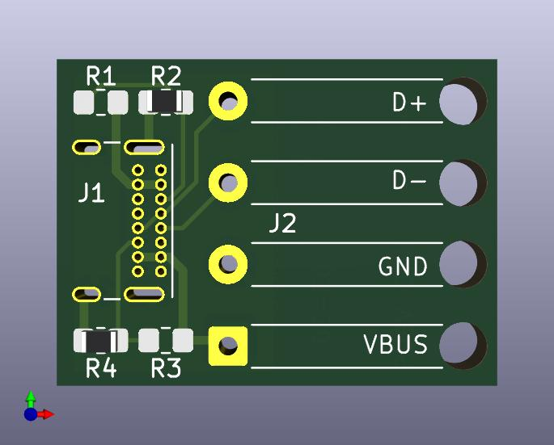
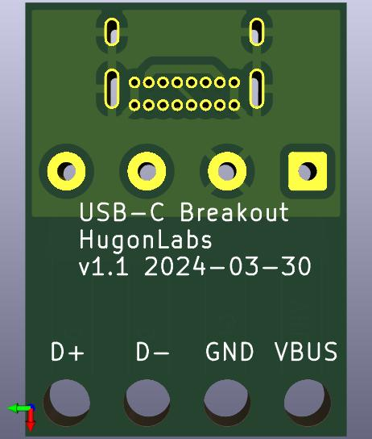

# KiCad USB-C Breakout Board

Breaks out the USB 2.0 signals of a USB-C connector: VBUS, GND, D+, D- to pads
for soldering wires.

See the [schematic](kicad_usbc_breakout_schematic.pdf),
[pcb](kicad_usbc_breakout_pcb.pdf), and [BOM](usbc_breakout_BOM.csv).

